# :hammer_and_wrench: Laboratorio 5 - MVC PrimeFaces Introduction

### :pushpin: Daniel Felipe Hernández Mancipe
 

## I. Jugando a ser un cliente HTTP

1. Abra una terminal Linux o consola de comandos Windows.
2. Realice una conexión síncrona TCP/IP a través de Telnet al siguiente servidor:
   
   * Host: www.escuelaing.edu.co
   * Puerto: 80
   
   Teniendo en cuenta los parámetros del comando telnet:
   
   `telnet HOST PORT`
   
3. Antes de que el servidor cierre la conexión por falta de comunicación:
   * Revise la página 36 del RFC del protocolo HTTP, sobre cómo realizar una petición GET. Con esto, solicite al 
   servidor el recurso `sssss/abc.html`, usando la versión 1.0 de HTTP.
   * Asegúrese de presionar ENTER dos veces después de ingresar el comando.
   * Revise el resultado obtenido. ¿Qué código de error sale?, revise el significado del mismo en la 
   [lista de códigos de estado HTTP](https://en.wikipedia.org/wiki/List_of_HTTP_status_codes).
   
     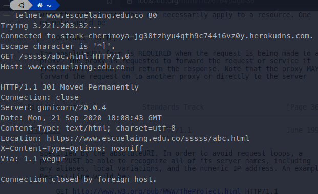
     
       **301 Moved Permanently**: Esta y todas las solicitudes futuras deben dirigirse al URI dado.
   
   * ¿Qué otros códigos de error existen?, ¿En qué caso se manejarán?
     
     Hay 5 tipos de estado los de tipo 100 hasta los de tipo 500
     
     * Código de estado 100 (100 ... 103)
       
       Son errores informáticos indicando que la petición se ha recibido y se continua el proceso.
       
     * Código de estado 200 (200 ... 208)
       
       Estos códigos indican que todo ha salido correctamente.
       
     * Código de estado 300 (300 ... 308)
       
       Están relacionados con re-direcciones. Los servidores usan estos códigos para indicar al navegador que la página 
       o recurso que han pedido se ha movido de sitio.

     * Código de estado 400 (400 ... 452)
       
       Corresponden a errores de cliente, el más conocido es el **error 404** que aparece cuándo la página que se 
       intentó buscar no existe.
       
     * Código de estado 500 (500 ... 511)
       
       Son errores por parte del servidor. Es posible que el servidor tenga algún problema temporal y no hay mucho que 
       se pueda hacer.

4. Realice una nueva conexión con telnet, esta vez a:
   * Host: www.httpbin.org
   * Puerto: 80
   * Versión HTTP: 1.1
   
   Ahora, solicite (GET) el recurso `/html`. ¿Qué se obtiene como resultado?
   
   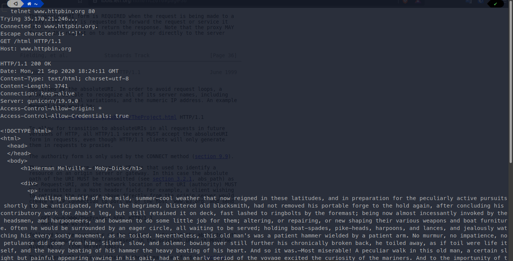
   
   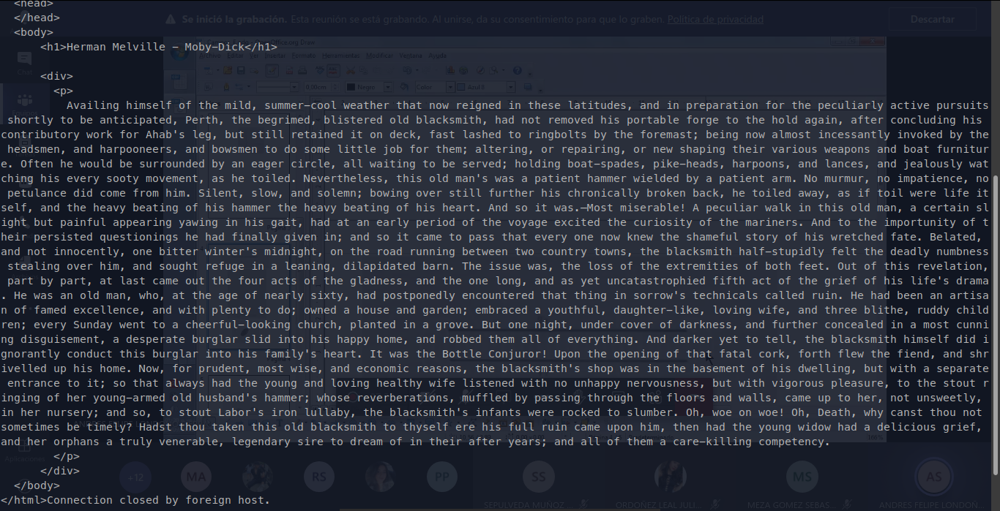
   
   ¡Muy bien!, ¡Acaba de usar del protocolo HTTP sin un navegador Web!. Cada vez que se usa un navegador, este se conecta 
   a un servidor HTTP, envía peticiones (del protocolo HTTP), espera el resultado de las mismas, y -si se trata de 
   contenido HTML- lo interpreta y dibuja.

5. Seleccione el contenido `HTML` de la respuesta y cópielo al cortapapeles `CTRL-SHIFT-C`. Ejecute el comando `wc` 
   (*world count*) para contar palabras con la opción `-c` para contar el número de caracteres:

   `wc -c`
   
   Pegue el contenido del portapapeles con `CTRL-SHIFT-V` y presione `CTRL-D` (fin de archivo de Linux). Si no termina 
   el comando wc presione `CTRL-D` de nuevo. No presione más de dos veces `CTRL-D` indica que se terminó la entrada y 
   puede cerrarle la terminal. Debe salir el resultado de la cantidad de caracteres que tiene el contenido HTML que 
   respondió el servidor.
   
   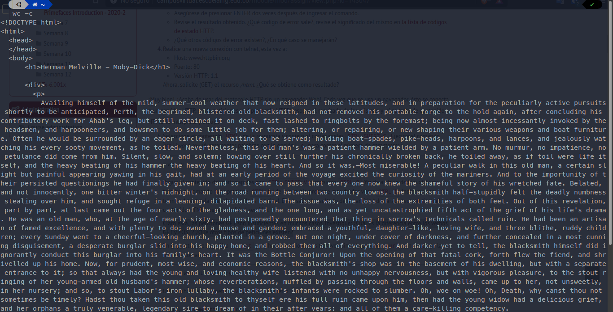
   
   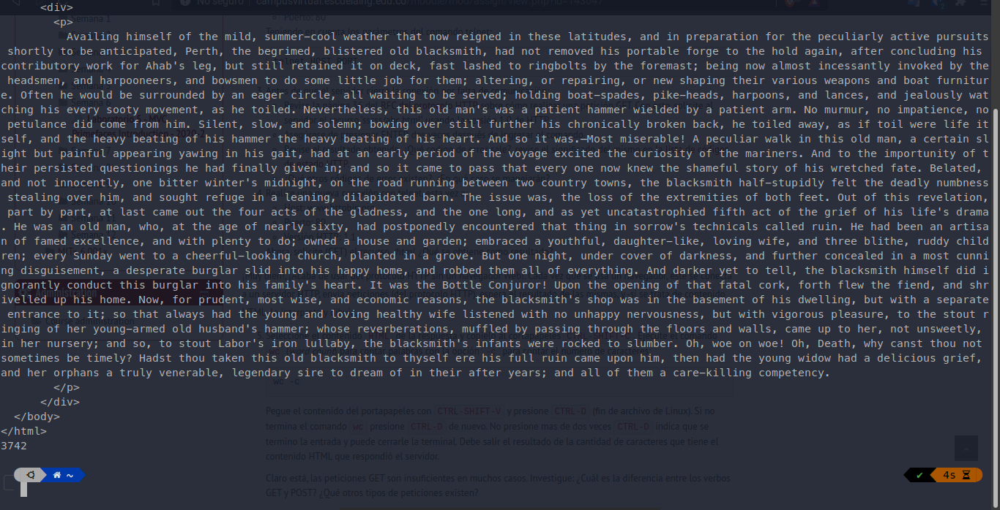
   
   Claro está, las peticiones GET son insuficientes en muchos casos. Investigue: ¿Cuál es la diferencia entre los verbos 
   GET y POST? ¿Qué otros tipos de peticiones existen?
   
   **Se respondió a estas preguntas en la parte III.**
   
6. En la práctica no se utiliza `telnet` para hacer peticiones a sitios web sino el comando curl:
   
   `curl www.httpbin.org`
   
   Utilice ahora el parámetro `-v` y con el parámetro `-i`:
   
   `curl -v www.httpbin.org`
   
   `curl -i www.httpbin.org`
   
   ¿Cuáles son las diferencias con los diferentes parámetros?
   
   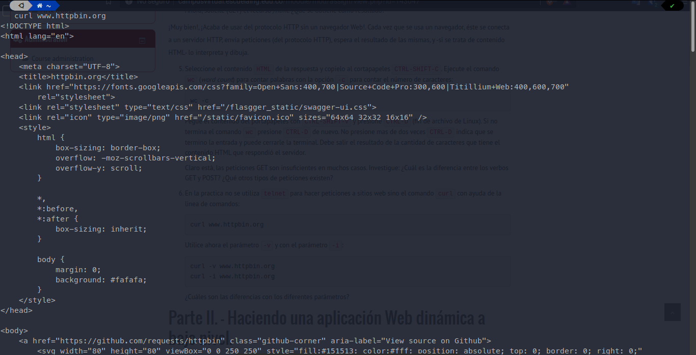
   
   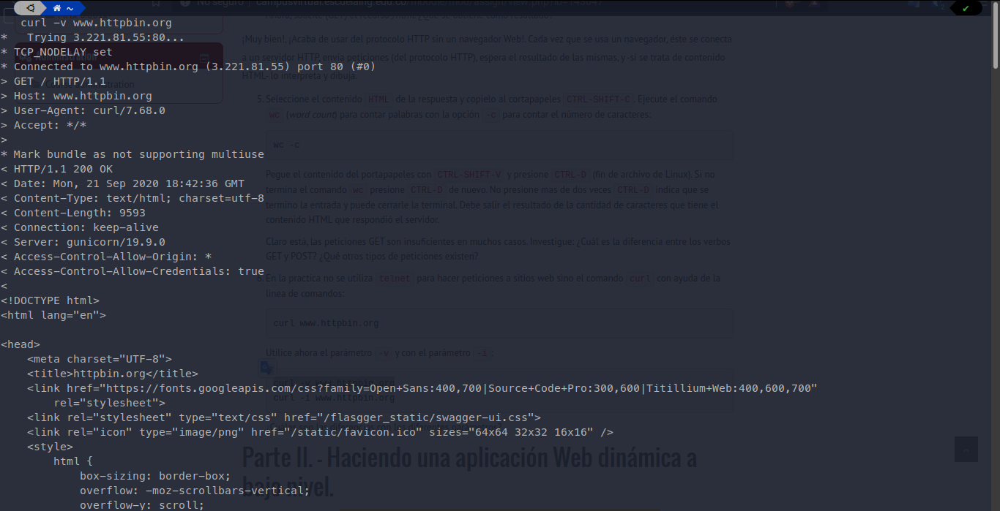
   
   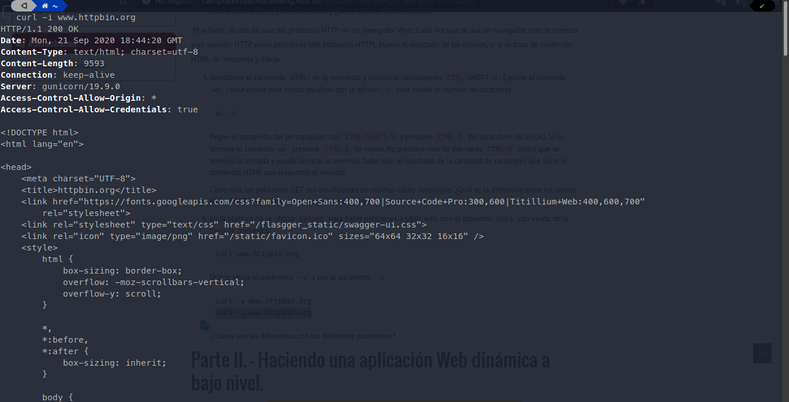
   
## II. Haciendo una aplicación Web dinámica a bajo nivel

Esta parte del laboratorio se encuentra desarrollada en el package [SampleServlet](/src/main/java/SampleServlet).

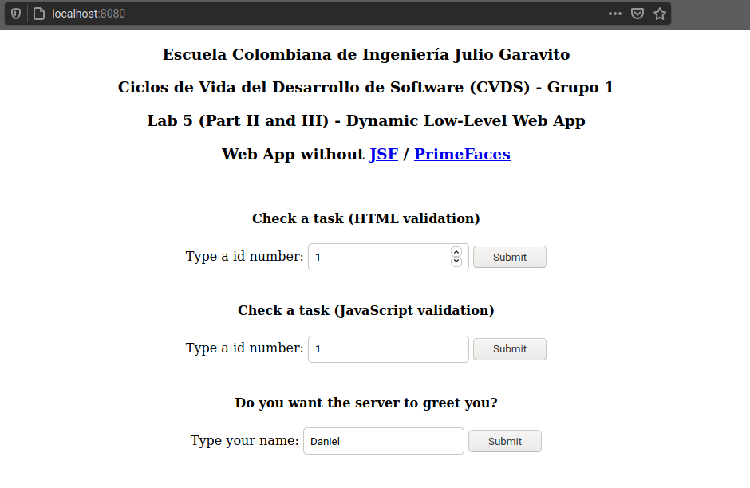

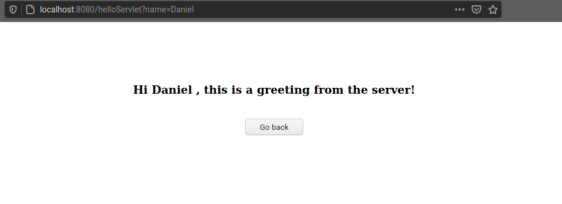

## III. Preguntas

Esta parte del laboratorio se encuentra desarrollada en el package [SampleServlet](/src/main/java/SampleServlet).

* Recompile y ejecute la aplicación. Abra en su navegador en la página del formulario, y rectifique que la página 
hecha anteriormente sea mostrada. Ingrese los datos y verifique los resultados. Cambie el formulario para que ahora en 
lugar de POST, use el método GET . Qué diferencia observa?

  La principal diferencia superficial que se puede observar está en la URL:
  
  * GET
      
    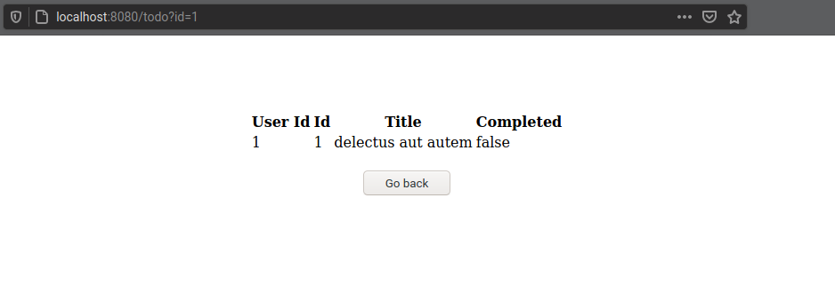
      
  * POST
      
    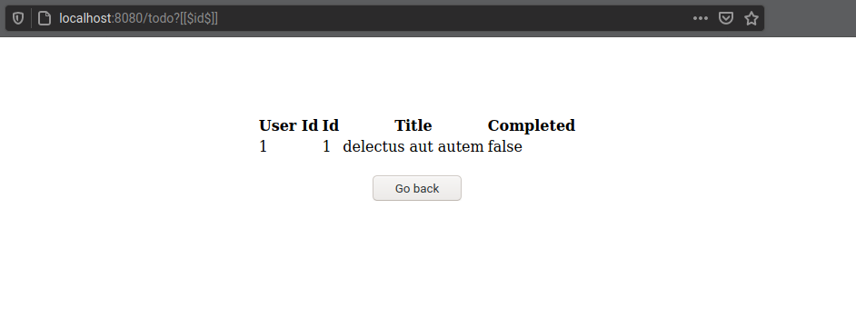
   
* Comparación entre GET y POST

  Las peticiones HTTP del tipo POST suelen proporcionar información adicional del cliente (navegador) al servidor dentro 
  del cuerpo del mensaje. Las peticiones GET, por otro lado, incluyen toda la información requerida o necesaria dentro 
  del URL (localizador de recursos uniforme). Los formularios en HTML pueden usar cualquiera de estos dos métodos solo si 
  se especifica si es POST (`method="post"`) o si es GET (`method="get"`) dentro del elemento `<form>`. Este último suele ser el 
  sugerido por default. El método que sea elegido y especificado determina la forma en la que la información será enviada 
  al servidor. Cuando se usa el método GET, la información se encontrará codificada dentro del URL, anexada a este como 
  parámetros de la cadena de consulta. En cuanto al uso de POST, los formularios aparecen incluidos dentro del cuerpo del 
  mensaje de la petición HTTP.
    
  #### Tabla comparativa:
    
  |  | GET | POST |
  | :---: | :---: | :---: |
  | Historial | Los parámetros permanecen en el historial del navegador. Esto debido a que forman parte del URL. | Los parámetros no son guardados en el historial del navegador. |
  | Marcadores | Acepta marcadores. | Por el contrario, POST no acepta marcadores. |
  | Comportamiento con el comando deshacer y rehacer | Las peticiones son re-ejecutadas, sin embargo, muchas no pueden ser reenviadas al servidor  (sólo si el HTML sigue almacenado en el caché del navegador). | Por lo general, en POST, el navegador alerta al usuario que los datos necesitan ser reenviados antes de ejecutar la acción. |
  | Parámetros | Puede enviar parámetros. Sin embargo el tamaño de estos se limita sólo a los que quepan dentro del mensaje de petición (URL). | Puede enviar parámetros, incluso si fuera necesario, puede subir archivos al servidor. |
  | Seguridad | GET tiende a ser menos seguro que POST, debido a que los datos enviados forman parte del URL. Los datos se almacenan en el historial del navegador y en los registros del servidor. | POST suele ser más seguro que GET. Esto debido a que los parámetros no se almacenan en el historial del navegador ni al iniciar sesión en algún servidor web. |
  | Uso | Hablando del método GET, en teoría este no debería ser usado cuando se envían contraseñas o información sensible. | Por otro lado, el método POST puede ser usado sin mayor problema al enviar formularios que contengan información sensible, como contraseñas. |
  | **Visibilidad** | **El método GET está visible para todos (se localiza en la barra de dirección del navegador). Este presenta límites en cuanto a la información que será enviada.** | **Las variables del método POST no se pueden visualizar en el URL** |
  | Caché (almacenamiento) | Puede almacenarse en la memoria caché. | No puede ocultarse en la memoria caché. |
    
* ¿Qué otros métodos similares existen? y ¿Para qué es cada uno?

  * OPTIONS
  
    El método OPTIONS representa una solicitud de información acerca de las opciones de comunicación disponibles en 
    el canal de solicitud/respuesta identificada por el Request-URI. En otras palabras, este método es el que 
    utilizamos para describir las opciones de comunicación existentes de un recurso destino. Dato: El cliente como 
    tal puede especificar una URL para este método o, en su lugar, utilizar un asterisco para referirse al servidor 
    completo.
        
  * HEAD
        
    El método HEAD es muy similar al GET (funcionalmente hablando), a excepción de que el servidor responde con 
    líneas y headers, pero no con el body de la respuesta.
        
  * PUT
    
    El método PUT es usado para solicitar que el servidor almacene el cuerpo de la entidad en una ubicación 
    específica dada por el URL.
        
  * POST
    
    El método POST es usado cuando se requiere enviar información al servidor como, por ejemplo, un archivo de 
    actualización, información de formulario, etc. En otras palabras, este método se usa cuando se necesita enviar 
    una entidad para algún recurso determinado. La diferencia entre PUT y POST es que PUT es ídem-potente, mientras 
    que si realizamos repetidas idénticas peticiones con el método POST, podría haber efectos adicionales como pasar 
    una orden varias ocasiones.
        
  * DELETE
    
    Este método es utilizado para solicitar al servidor que elimine un archivo en una ubicación específica dada por 
    la URL. En otras palabras más simples, este método elimina un recurso determinado.
        
  * CONNECT
    
    Este método por su parte es usado por el cliente para establecer una conexión de red con un servidor web 
    mediante HTTP misma que se establece en forma de un túnel.
        
  * TRACE
    
    Este método se utiliza para realizar pruebas de eco (de retornos) de mensajes en el camino que existe hacia un 
    recurso determinado. Es un método muy utilizado para la depuración y también para el desarrollo.

## IV. Frameworks Web MVC – Java Server Faces / Prime Faces

Esta parte del laboratorio se encuentra desarrollada en el package [WebAppJSF](/src/main/java/WebAppJSF).

* Anotación @ManagedBean

  **@ManagedBean** marca un bean como un bean gestionado / administrado con el nombre especificado en el 
  atributo `name`. Si no se especifica el atributo de nombre, entonces el nombre del bean administrado tomará por 
  defecto la parte del nombre de clase del nombre de clase completo. En nuestro caso, sería `calculatorBean`.
  
  Otro atributo importante es el ansia (`eager`). Si `eager = "true"`, el bean administrado se crea antes de que se 
  solicite por primera vez; de lo contrario, se utiliza una inicialización "perezosa" en la que el bean se creará solo 
  cuando se solicite.
  
* Anotación de alcance (scope) 

  | Anotación | Descripción |
  | :---: | :---: |
  | @RequestScoped | Bean vive mientras viva la solicitud-respuesta HTTP. Se crea a partir de una solicitud HTTP y se destruye cuando finaliza la respuesta HTTP asociada con la solicitud HTTP. |
  | @NoneScoped | Bean vive tanto como una sola evaluación EL. Se crea en una evaluación EL y se destruye inmediatamente después de la evaluación EL. |
  | @ViewScoped | Bean vive mientras el usuario esté interactuando con la misma vista JSF en la ventana / pestaña del navegador. Se crea a partir de una solicitud HTTP y se destruye una vez que el usuario devuelve la información a una vista diferente. |
  | **@SessionScoped** | Bean vive mientras viva la sesión HTTP. Se crea en la primera solicitud HTTP que involucra este bean en la sesión y se destruye cuando la sesión HTTP se invalida. |
  | **@ApplicationScoped** | Bean vive tanto como la aplicación web. Se crea en la primera solicitud HTTP que involucra este bean en la aplicación (o cuando la aplicación web se inicia y el atributo `eager = true` se establece en @ManagedBean) y se destruye cuando la aplicación web se apaga. |
  | @CustomScoped | Bean vive mientras viva la entrada del bean en el mapa personalizado, que se crea para este ámbito. |
  
  Para el ejercicio de usar dos sesiones distintas de navegador y usar la aplicación en cada una:
  
  Con **@ApplicationScoped** todas las sesiones de navegador comparten la misma instancia del bean, es decir, comparten 
  la misma calculadora, lo que puede generar conflictos indeseables, ya que solo una persona podría usar la aplicación 
  al mismo tiempo de manera correcta.
  
  Con **@SessionScoped** todas las sesiones de navegador tienen su propia instancia del bean, es decir, manejan su 
  propia calculadora, lo que permite que muchos usuarios puedan usar la aplicación al mismo tiempo sin generar 
  conflictos entre ellos.

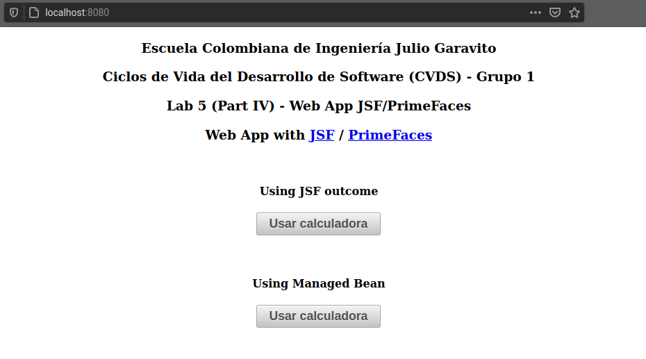

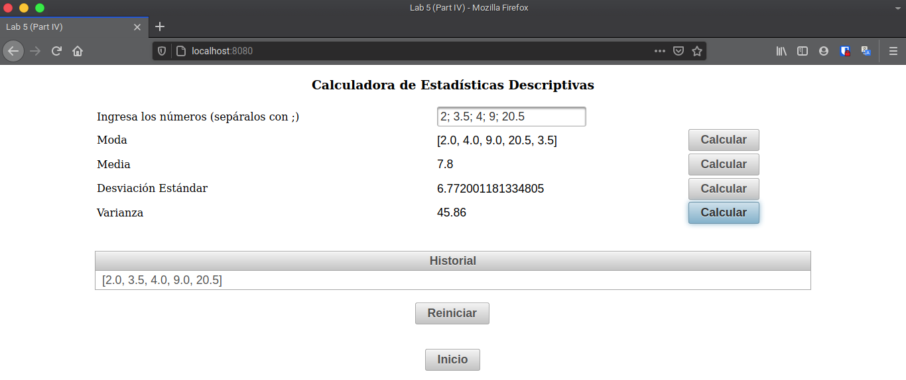

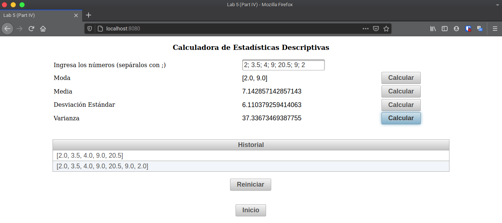

## Diagramas de Clases

* SampleServlet:

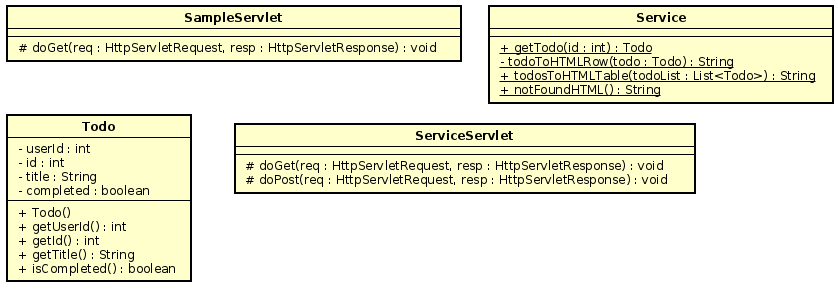

* WebAppJSF:

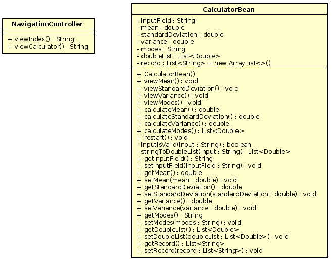
